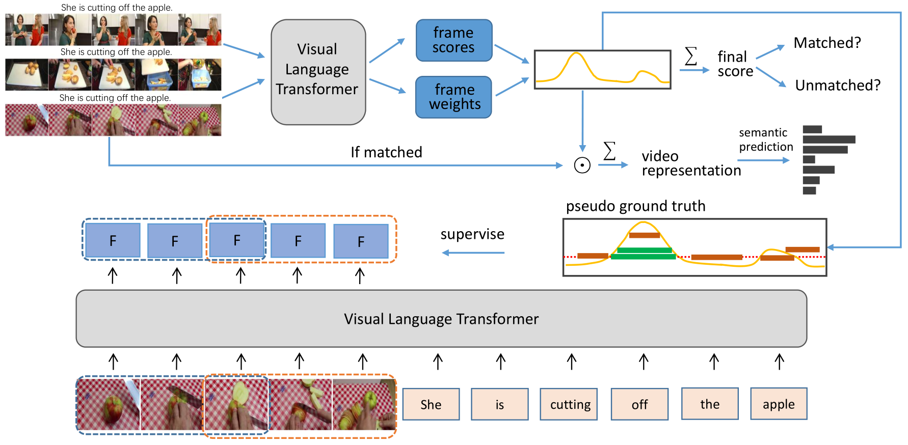

# WLML

This is the code for the paper "Temporal Plot and Semantic Mining for Weakly-Supervised Language Moment Localization".

## Framework


## Main Results

#### Main results on Charades-STA
| Method | Rank1@0.5 | Rank1@0.7 | Rank5@0.5 | Rank5@0.7 |
| ---- |:-------------:| :-----:|:-----:|:-----:|
| LOC-PSE (C3D)  | 38.41 | 21.24 | 83.09 | 49.25 |
| LOC-PSE (VGG)  | 41.32 | 23.74 | 82.82 | 49.22 |

#### Main results on ActivityNet Captions 
| Method | Rank1@0.3 | Rank1@0.5 | Rank5@0.3 | Rank5@0.5 |
| ---- |:-------------:| :-----:|:-----:|:-----:|
| LOC-PSE (C3D)  | 56.50 | 34.38  | 83.75 | 71.01 |
| LOC-PSE (ResNet152)  | 57.11 | 34.11 | 83.13 | 70.08 |

## Prerequisites
- python 3.7
- pytorch 1.7.1
- torchvision 0.8.2
- torchtext 0.8.1
- pattern 3.6
- easydict
- terminaltables

#### Testing
Please download the data from [google drive](https://drive.google.com/drive/folders/1yLfaC_zhk-QH5ETrOd-GtxD5CCuhJHwJ?usp=sharing). Because the data is large, we split it into four files. Please use the following commands to merge them and untar it to the `WLML/` folder. 
```
cd WLML
cat data.tar.gz.* > data.tar.gz
tar -zxvf data.tar.gz
```
We also provide the VGG video feature for Charades-STA and ResNet152 video feature for ActivityNet Captions. They are in data2.tar.gz.\*.

Our trained models are provided in [google drive](https://drive.google.com/drive/folders/1MrhgLLp7RXayUMkyXWQqsoe4zKjbxnxF?usp=sharing). Please download them and also untar them to the `WLML/` folder.

Then, run the following commands for reproducing the above results:
```
# Evaluate CT-SP-16L
cd CT_SP
CUDA_VISIBLE_DEVICES=0 python moment_localization/test.py --cfg experiments/charades/charades-16L.yaml --verbose --split test
CUDA_VISIBLE_DEVICES=0 python moment_localization/test.py --cfg experiments/activitynet/activitynet-16L.yaml --verbose --split test

# Evaluate CT-SP-32L
cd CT_SP
CUDA_VISIBLE_DEVICES=0 python moment_localization/test.py --cfg experiments/charades/charades-32L.yaml --verbose --split test
CUDA_VISIBLE_DEVICES=0 python moment_localization/test.py --cfg experiments/activitynet/activitynet-32L.yaml --verbose --split test

# Evaluate CT-SP-MS
cd CT_SP_MS
CUDA_VISIBLE_DEVICES=0 python moment_localization/test.py --cfg experiments/charades/charades-ms.yaml --verbose --split test
CUDA_VISIBLE_DEVICES=0 python moment_localization/test.py --cfg experiments/activitynet/activitynet-ms.yaml --verbose --split test

# Evaluate LOC-PSE (Ours)
cd LOC_PSE
CUDA_VISIBLE_DEVICES=0 python moment_localization/test.py --cfg experiments/charades/charades-loc-pse.yaml --verbose --split test
CUDA_VISIBLE_DEVICES=0 python moment_localization/test.py --cfg experiments/activitynet/activitynet-loc-pse.yaml --verbose --split test
```
To reproduce the results using VGG and ResNet152 video features, please replace the charades-\*.yaml with charades-\*-vgg.yaml and activitynet-\*.yaml with activitynet-\*-resnet152.yaml respectively. Besides, before evaluating LOC-PSE, please first evaluate CT-SP-MS to produce the last score curve which is loaded in the dataloader of LOC_PSE. Note that the score curve is not used during inferring, it is only used in the training stage of LOC_PSE.

#### Training
To re-train the models, please use the following commands:
```
# train the model for genrating matching score curve at the scale of 16
cd CT_SP
CUDA_VISIBLE_DEVICES=0 python moment_localization/train.py --cfg experiments/charades/charades-16L.yaml --verbose
CUDA_VISIBLE_DEVICES=0 python moment_localization/train.py --cfg experiments/activitynet/activitynet-16L.yaml --verbose

# train the model for genrating matching score curve at the scale of 32
cd CT_SP
CUDA_VISIBLE_DEVICES=0 python moment_localization/train.py --cfg experiments/charades/charades-32L.yaml --verbose
CUDA_VISIBLE_DEVICES=0 python moment_localization/train.py --cfg experiments/activitynet/activitynet-32L.yaml --verbose

# fuse the matching score curves of the two scales
cd CT_SP_MS
CUDA_VISIBLE_DEVICES=0 python moment_localization/test.py --cfg experiments/charades/charades-ms.yaml --verbose --split train
CUDA_VISIBLE_DEVICES=0 python moment_localization/test.py --cfg experiments/charades/charades-ms.yaml --verbose --split val
CUDA_VISIBLE_DEVICES=0 python moment_localization/test.py --cfg experiments/charades/charades-ms.yaml --verbose --split test

CUDA_VISIBLE_DEVICES=0 python moment_localization/test.py --cfg experiments/activitynet/activitynet-ms.yaml --verbose --split train
CUDA_VISIBLE_DEVICES=0 python moment_localization/test.py --cfg experiments/activitynet/activitynet-ms.yaml --verbose --split val
CUDA_VISIBLE_DEVICES=0 python moment_localization/test.py --cfg experiments/activitynet/activitynet-ms.yaml --verbose --split test

# train the final localization model
cd LOC_PSE
CUDA_VISIBLE_DEVICES=0 python moment_localization/train.py --cfg experiments/charades/charades-loc-pse.yaml --verbose
CUDA_VISIBLE_DEVICES=0 python moment_localization/train.py --cfg experiments/activitynet/activitynet-loc-pse.yaml --verbose
```
Note that after training the models for genrating matching score curves of the two scales, we need to set the MODEL.CHECKPOINT_2 and MODEL.CHECKPOINT_3 options in charades-ms.yaml or activitynet-ms.yaml to deploy the right models to fuse the score curves.

To re-train the models using VGG and ResNet152 video features, please also replace the charades-\*.yaml with charades-\*-vgg.yaml and activitynet-\*.yaml with activitynet-\*-resnet152.yaml respectively.
